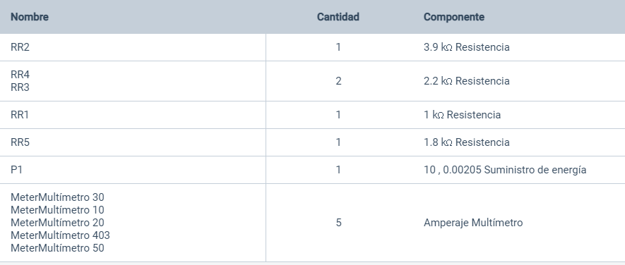
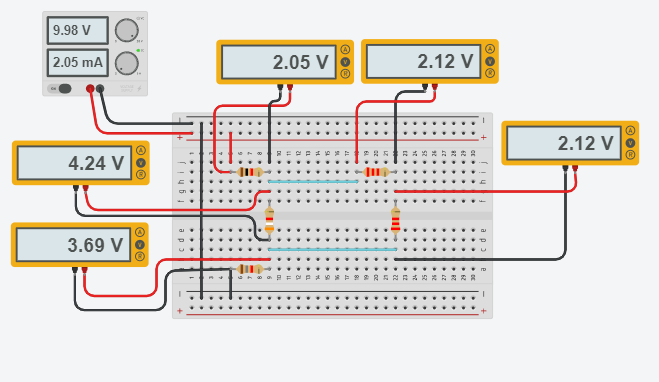
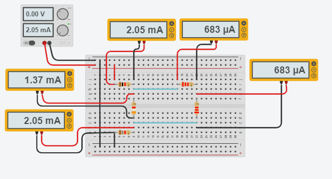

------------
 **Asignatura:**  Fundamentos de Circuitos Eléctricos 
                          
 **Docente:**     Ing. Darwin Alulema            
                    
 **Integrantes:** Mera Erick, Quilumbaquin Lenin, Vallejo Keily
                  
 **Semestre:**    Segundo
 
 **Parcial:**     1
 
 **Laboratorio Nro:**     1
 
------------
## **TEMA:**  Leyes de Kirchoff
------------

1. **OBJETIVOS**

 - Explicar y demostrar experimentalmente la Ley de Kirchhoff de voltajes y de corrientes, en este circuito resistivo  mixto  mediante un simulador y cálculos realizados por los estudiantes.
 - Verificar por medio de cálculos analíticos que la suma de las corrientes que entran en un nodo es la suma de las corrientes que sale.
 - Comparar los resultados calculados con los del simulador para obtener una aproximación de error en los resultados calculados. 

Los objetivos deben responder claramente la pregunta ¿Qué investigar? El objetivo de la investigación es el enunciado claro y preciso de las metas que se persiguen. En los objetivos de la investigación se detallan las acciones en las que debe emprender el investigador para contestar a las preguntas planteadas en la formulación y sistematización del problema y tiene como propósito el direccionar la investigación.

Los objetivos generales dan origen a objetivos específicos que indica lo que se pretende realizar en cada una de las etapas de la investigación. La suma de los objetivos específicos es igual al objetivo general y por tanto a los resultados esperados de la investigación. Conviene notar que son los objetivos específicos los que se investigan y no el objetivo general, ya que este se logra de los resultados.

Los objetivos de investigación deben cumplir ciertas características:

Deben ser concretos, cuantificables, verificables
Deben estar redactados utilizando verbos en infinitivo
Deben ser alcanzables por el investigador.
Tienen que estar ligados con el tiempo.
Deben presentar directa relación con el tema de investigación y entre sí mismos. Todo trabajo de investigación es evaluado por el logro de los objetivos mediante un proceso sistemático, los cuales deben haber sido previamente señalados y seleccionados al comienzo de la investigación. La sistematización hace posible el planeamiento de estrategias válidas para el logro de objetivos. Por esta razón los objetivos tienen que ser revisados en cada una de las etapas del proceso; el no hacerlo puede ocasionar fallas en la investigación con la misma intensidad en que se presentan fallas en los objetivos.

2. **MARCO TEÓRICO (RESUMEN)**

Se describe la teoría o conjunto teórico apropiado con la cual el investigador enfrenta su proyecto y la realidad dentro del cual se ubica el problema de investigación, incluye:

+Describir la actual relación entre el problema enunciado y el sistema o sistemas teóricos/conceptuales que pueden guiarlo.
+Dejar claramente especificada la relación entre la teoría que guía la investigación y la realidad que se percibe como problema de investigación.
+Conceptualizar el problema en la forma de un modelo, útil para clarificar los conceptos y relaciones conceptuales.
+Señalar la forma en que la investigación actual enriquece, amplía y profundiza el conocimiento teórico, sustantivo y metodológico acumulado en estudios previos.

3. **EXPLICACIÓN Y RESOLUCIÓN DE EJERCICIOS O PROBLEMAS**
   
   
MATERIAL Y EQUIPO DE APOYO

   
   
PROCEDIMIENTO

 Arme el circuito que se muestra en la figura 1.1
   
   
   
   
Medición del voltaje y corriente en cada uno de los elementos del circuito. 
Tabla 1.1 Resultados obtenidos de voltaje y corriente, en cada elemento del circuito

   
   
   Tabla 1.2 Verificación de la LVK
   
   
   
   Tabla 1.3 Verificación de la LCK
   
   
   
   Comparación de resultados medidos con los valores obtenidos al analizar el circuito analíticamente. 
   
   
   
   
  
4. **VIDEO**

5. **CONCLUSIONES**

- La corriente que entró a las nodos a y b no se almacenaron, por el contrario se distribuye por las ramas que conforman el nodo. Es decir, no se alamcena nada en la fuente. En el circuito mixto de la práctica se evidencia que la corriente que sale en el nodo "b" es IT e I1 y entra I2 de modo que se equilibra la corriente demostrando la primera ley de kirchoff. 
      
- El voltaje de entrada que tuvo el ciruito mixto fue uno igual a 10 V. Las caidas de potencial se representan como la pérdida de energía debido a las resistencias cuando sobre ellas pasa una corriente. En la trayectoria una conformada por la R1, R5 y RB. Aquello que se encarga en la entrada de electrónes en un circuito como una batería, se tiene que equilibrar con todo lo que se está perdiendo en las caídas de potencial por las resistencias. Las resistencias se encargan de abosrben la energía y hace que la corriente se frene y a consecuencia de eso hay una caída de voltaje. Los 10 Volts de entrada se consumieron en el circuito. 

- Con la práctica de laboratorio aprendimos que las leyes de Kirchhoff son una herramienta muy útil para analizar los circuitos de una manera sencilla. Se encontró de forma teórica los valores de corriente que fluye por el circuito y las caídas de voltaje que se producen a causa de las resistencias. 

- Conocimos más sobre estas leyes y cómo funcionan cada una, a la hora de realizar el circuito en el emulador.

- Se concluyó que la medicon de las trayectorias ,la cantidad de corriente que entra y sale existe.

- La entrada de corriente de una trayectoria se complementa de izquierda a derecha es decir que el exceso de  una trayectoria 1 se dirige a la  trayectoria 2 y el exceso de

**RECOMENDACIONES**

- Se recomienda terminar de realizar bien el circuito antes de ejecutarlo.
- Se recomienda tomar en cuenta siempre el porcentaje de error que existe entre los cálculos de los circuitos. 

**BLIOGRAFÍA**

*eduMedia. (2021).* Leyes de kirchhoff. *Obtenido de:* https://www.edumedia-sciences.com/es/media/510-leyes-de-kirchhoff

*Ramirez, A. (2019).* Leyes de kirchhoff. *Obtenido de:* https://d1wqtxts1xzle7.cloudfront.net/63362670/Leyes_de_Kirchhoff20200519-84014-3f6yxn-with-cover-page.pdf?Expires=1622691176&Signature=B8KzIgIqeGOWUxcWfU4mE9lMVg4yF4yQoevbRQJgX5MLXe6mPFyfM4IBnSKW2fRwZOY7DDf5ZPQvwSM5dXVglBIAhRX0KDhubwoJpYXwHfWfGnGvlNKCgod0AXDUX5p7x~Asqenx~2s1dKdRUzy8jFlHVdzFJnYt7I-Stv-MAV9ypU4ew8fMKoWoebHkinm~3SXQt8mfP-OMLFKLg2DAwBDJzXmlVP8XNdk~wUcF-D8BHtw~S~uFKn-edchsVbwzx24S4hhCeOgusnXb9R3mfea7sJ0SBw1HGNFvojgSSykz4CWe949Ia0k8OnzODyNle8gNenHinAAq2oFSgQZqCQ__&Key-Pair-Id=APKAJLOHF5GGSLRBV4ZA

