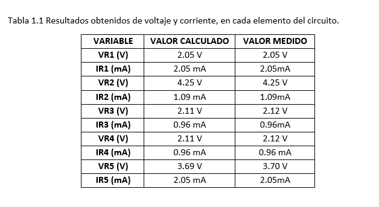

------------
 **Asignatura:**  Fundamentos de Circuitos Eléctricos 
                          
 **Docente:**     Ing. Darwin Alulema            
                    
 **Integrantes:** Mera Erick, Quilumbaquin Lenin, Vallejo Keily
                  
 **Semestre:**    Segundo
 
 **Parcial:**     1
 
 **Laboratorio Nro:**     1
 
------------
## **TEMA:**  Leyes de Kirchoff
------------

 2. **OBJETIVOS**
 ------------

#### Objetivo General:

 - Analizar mediante los leyes de kirchoff las caídas de voltaje y distribución de corriente en cualquier circuito. 

#### Objetivos Específicos:

 - Verificar por medio de cálculos analíticos que la suma de las corrientes que entran en un nodo es la suma de las corrientes que salen.
 - Comparar los valores medidos y calculados para obtener una porcentaje de error de los resultados. 
 - Aplicar de manera correcta la segunda Ley de Kirchoff en el circuito de la práctica para obtener los valores de voltaje. 
 - Diseñar el cicuito de la práctica en un simulador de corriente para comprobar los resultados obtenidos. 
 - Identificar en el circuito mixto los conceptos de nodo y malla. 

2. **MARCO TEÓRICO (RESUMEN)**

  El circuito es mixto de modo que la suma de sus resistencias es diferente en cada malla. El flujo de corriente en la malla 2 es en paralelo tal que el amperaje es el mismo   para las dos resistencias de esa malla. La fuente de voltaje suministra  es de 10 Volts la cual se tiene que consumir en las resistencias provocando caídas de voltaje.
  
  
  
  
  
  
  
  El cálculo de corriente es importante para que no exista un aumento o descenso de energía en el circuito, causando cortocircuitos o un mal funcionamiento.  

 
3. **EXPLICACIÓN Y RESOLUCIÓN DE EJERCICIOS O PROBLEMAS**

   
   
MATERIAL Y EQUIPO DE APOYO

   
   
   
PROCEDIMIENTO

 Arme el circuito que se muestra en la figura 1.1
 
   
   
   
   
   
 
   
  
   
   
   
   
   
   
   
   
   

4. **VIDEO**

[Circuito Mixto Tinkercad ](http://https://youtu.be/JEmD1EWamV4 "Circuito Mixto Tinkercad ")

5. **CONCLUSIONES**

- La corriente que entró a las nodos 1 y 2 no se almacenaron, por el contrario se distribuye por las ramas que conforman el nodo. En el circuito mixto de la práctica se evidencia que la corriente que sale en el nodo "1" es IT y entra I1 e I2 de modo que se equilibra la corriente demostrando la primera ley de kirchoff. 
     
- La fuente de voltaje que se encarga de suministar energía se tiene que equilibrar con todo lo que se está perdiendo en las caídas de potencial. Las resistencias se encargan de absorber la energía y hace que la corriente se frene y a consecuencia de eso hay una caída de voltaje. Los 10 Volts de entrada se consumieron en el circuito. 

- Con la práctica de laboratorio aprendimos que las leyes de Kirchhoff son una herramienta muy útil para analizar los circuitos de una manera sencilla. Se encontró de forma teórica los valores de corriente que fluye por el circuito y las caídas de voltaje que se producen a causa de las resistencias. 

- Conocimos más sobre estas leyes y cómo funcionan cada una, a la hora de realizar el circuito en el emulador y se comprobó que los valores calculados con los medidas fueron similares. Se debe mencionar que en las operaciones se empleó las cifras significativas. 

- Se concluyó que en las trayectorias se componen de nodos y mallas lo que nos permitió visualizar de manera más sencilla el comportamiento de la corriente. Del nodo 1 no existe  porcentaje de error entre el valor de la corriente calculada con el medido evidenciando así que  los cálculos realizados fueron exactos.
- El porcentaje de error en el voltaje de R5 de la trayectoria 1 fue de 0.27% lo que indica una diferencia pequeña entre el valor estimado y el valor real. 

**BLIOGRAFÍA**

*eduMedia. (2021).* Leyes de kirchhoff. *Obtenido de:* https://www.edumedia-sciences.com/es/media/510-leyes-de-kirchhoff

*Ramirez, A. (2019).* Leyes de kirchhoff. *Obtenido de:* https://d1wqtxts1xzle7.cloudfront.net/63362670/Leyes_de_Kirchhoff20200519-84014-3f6yxn-with-cover-page.pdf?Expires=1622691176&Signature=B8KzIgIqeGOWUxcWfU4mE9lMVg4yF4yQoevbRQJgX5MLXe6mPFyfM4IBnSKW2fRwZOY7DDf5ZPQvwSM5dXVglBIAhRX0KDhubwoJpYXwHfWfGnGvlNKCgod0AXDUX5p7x~Asqenx~2s1dKdRUzy8jFlHVdzFJnYt7I-Stv-MAV9ypU4ew8fMKoWoebHkinm~3SXQt8mfP-OMLFKLg2DAwBDJzXmlVP8XNdk~wUcF-D8BHtw~S~uFKn-edchsVbwzx24S4hhCeOgusnXb9R3mfea7sJ0SBw1HGNFvojgSSykz4CWe949Ia0k8OnzODyNle8gNenHinAAq2oFSgQZqCQ__&Key-Pair-Id=APKAJLOHF5GGSLRBV4ZA

